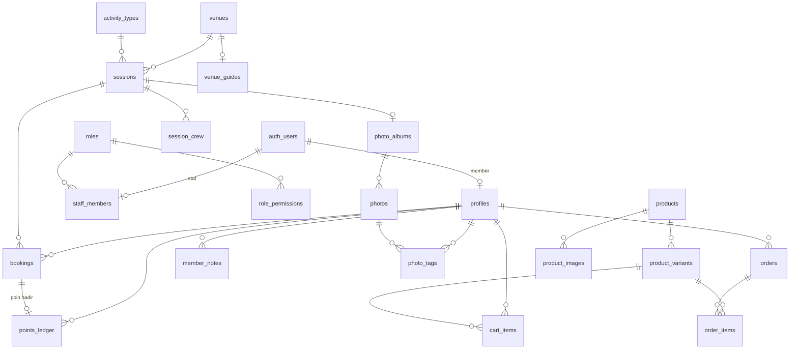

# 04 — Database (Supabase / Postgres)

Satu database melayani **website publik**, **member dashboard**, dan **admin (CMS + CRM)**.
Skema: [`web/supabase/migrations/20261007000000_init.sql`](../web/supabase/migrations/20261007000000_init.sql) · validasi: `npm run db:check` (Postgres sungguhan via PGlite, tanpa Docker).

## Skala & keputusan desain

| Asumsi | Angka | Dampak ke desain |
|---|---|---|
| Member terdaftar | 500 → 1.500 | Ribuan baris saja — Postgres tanpa sharding/partisi |
| Member aktif / bulan | 100–200 | Query dashboard ringan; cukup **VIEW** (`member_stats`, `session_fill`) — tidak perlu tabel ringkasan |
| Sesi / minggu | 10–20, kapasitas 12–32 | `bookings` tumbuh ±1.000–2.000 baris/bulan |
| Order shop / bulan | 50–300 | `orders` + `order_items` dengan snapshot harga |
| Foto per sesi | 40–120 | File di **Supabase Storage**, tabel hanya menyimpan path |

Prinsip:
1. **Satu sumber kebenaran** — tier, poin, statistik dihitung dari data mentah (bookings, points_ledger, orders), bukan diketik ulang.
2. **Poin = ledger** (`points_ledger`), bukan kolom saldo → setiap perubahan poin bisa diaudit ("+50 pts hadir", "−180 penukaran").
3. **Otomatisasi di database** (trigger): kode member `SOS 0067 2507`, poin kehadiran saat check-in, tier naik otomatis saat ambang tercapai.
4. **Keamanan di database** (Row Level Security): member hanya melihat datanya sendiri; staf dibatasi per modul sesuai matriks *Settings & Roles*.
5. **Snapshot transaksi** — `order_items` menyimpan nama/varian/harga saat beli; edit produk tidak mengubah riwayat.

## Diagram relasi



## Tabel per area

| Area | Tabel | Catatan |
|---|---|---|
| Akses tim | `roles`, `role_permissions`, `staff_members` | Matriks modul × role (Ubah/Lihat/—). Fungsi `has_permission(modul, akses)` dipakai semua policy |
| Member (CRM) | `profiles`, `membership_tiers`, `member_notes`, `member_segments` | `profiles.id` = `auth.users.id`. Segmen disimpan sebagai filter JSON |
| Venue | `venues`, `venue_guides` | Participant Guide disimpan sebagai JSON (struktur sama dengan `src/content/guides.ts`) |
| Aktivitas | `activity_types`, `sessions`, `session_series`, `session_crew`, `bookings` | Status booking: registered → attended / no_show / cancelled / waitlisted |
| Slay Point | `points_ledger` | Saldo = `SUM(delta)`; tier dari poin kumulatif (`delta > 0`) |
| Shop | `products`, `product_images`, `product_variants`, `cart_items`, `orders`, `order_items` | Stok per varian; kode order `SOS-2309` dari sequence |
| Konten | `content_sections`, `testimonials` | `draft` (diedit admin) vs `published` (dibaca website) → tombol *Publikasikan* |
| Galeri | `photo_albums`, `photos`, `photo_tags` | Tag member di foto → "Foto saya" + avatar di galeri venue |
| Sistem | `app_settings`, `integrations`, `admin_audit_log` | Secret integrasi **tidak** disimpan di tabel (pakai Supabase Vault / env) |

## Satu data, dua dashboard

| Tampilan | Member dashboard (`/akun`) | Admin |
|---|---|---|
| Kartu member, tier, poin | `profiles` + `member_stats` (milik sendiri) | Detail member → header & statistik |
| Slay Activity bulan ini | `bookings` status `attended` bulan berjalan + `app_settings.monthly_session_target` | Overview → KPI & grafik booking |
| Info grafis (ring & heatmap) | `bookings ⨝ sessions` per hari + `app_settings.annual_targets` | — |
| Daftar aktivitas / My Activities | `bookings ⨝ sessions ⨝ venues` milik sendiri | Detail member → Riwayat booking; Activity editor → Peserta & absensi |
| Order / keranjang | `cart_items`, `orders` milik sendiri | Orders |
| Profile form | `profiles` (update baris sendiri; tier/status dikunci trigger) | Detail member → Tennis profile, preferensi, akun |
| Foto saya | `photo_tags` ⨝ `photos` | Konten & Galeri → album, tag member |

## Keamanan (RLS) ringkas

- **Publik (anon)**: baca sesi `published` + `public`, venue aktif, produk aktif, konten aktif, album `published`.
- **Member login**: baca/ubah `profiles` miliknya (kolom tier/status/member_code dikunci), booking sesi yang `published` & belum mulai, baca booking/poin/order/keranjang miliknya.
- **Staf**: akses per modul lewat `has_permission()`; contoh Kasir Shop hanya `products`/`orders` (edit) + `overview`/`members` (lihat).
- Aksi sensitif (check-in, ubah status order, catatan) tercatat di `admin_audit_log`.

## Setup Supabase

Kode sudah siap: tanpa env, website & admin jalan dengan data demo; begitu env diisi, login
Supabase + penjagaan admin aktif otomatis.

1. Buat project di [supabase.com](https://supabase.com) (region **Singapore**).
2. Salin `web/.env.example` → `web/.env.local`, isi:
   - `NEXT_PUBLIC_SUPABASE_URL`, `NEXT_PUBLIC_SUPABASE_ANON_KEY` — *Project Settings → API*.
   - `DATABASE_URL` — *Project Settings → Database → Connection string* (mode **Session pooler**). Hanya dipakai script setup di laptop; jangan dibagikan.
   - Service role key **tidak** dibutuhkan aplikasi.
3. Pasang skema + data contoh: `cd web && npm run db:setup` (atau `npm run db:setup -- --no-seed` untuk database kosong).
4. Buat akun admin pertama: *Authentication → Users → Add user* (email + password kamu), lalu di *SQL Editor*:
   ```sql
   insert into staff_members (user_id, role_id, full_name, email, status)
   select u.id, r.id, 'Nama Kamu', u.email, 'active'
   from auth.users u, roles r
   where u.email = 'email-kamu@domain.com' and r.name = 'Super Admin';
   ```
5. Restart `npm run dev`, buka `/admin` → diarahkan ke `/masuk` → login dengan akun tadi.
6. Buat bucket Storage: `avatars`, `photos`, `products` (publik baca).

Perintah terkait: `npm run db:check` (uji migration di PGlite), `npm run db:seed:generate` (buat ulang `supabase/seed.sql` dari data demo), `npm run db:seed:check` (uji seed di PGlite).

### Status integrasi kode
| Bagian | Status |
|---|---|
| Klien Supabase (server/browser), refresh sesi di `src/proxy.ts` | ✅ |
| Login `/masuk` (server action `signIn`), tombol Keluar admin | ✅ |
| Admin hanya untuk staf aktif; menu mengikuti izin role (`my_admin_access()`) | ✅ |
| Seed data contoh (540 member, 354 sesi, 5.404 booking, 340 order) | ✅ |
| Repo admin (`src/server/admin/*-repo.ts`) membaca Supabase | ⏳ masih data demo — diganti per modul setelah project tersambung |
